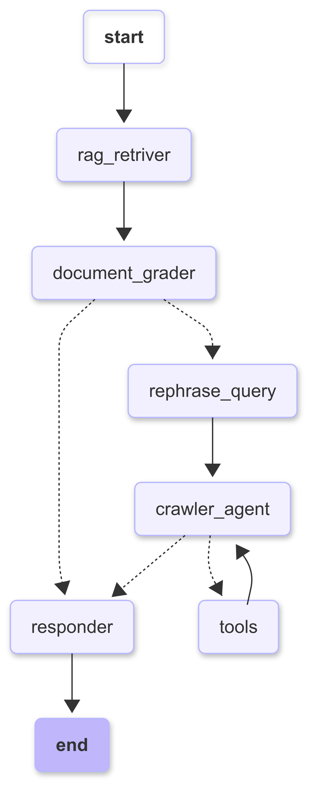

# Corrective Retrieval-Augmented Generation (CRAG)

## Overview

Corrective RAG is an advanced Retrieval-Augmented Generation (RAG) system that enhances response accuracy by validating retrieved context and dynamically rephrasing queries when necessary. If the retrieved documents are irrelevant or insufficient, the system automatically refines the query and leverages a web search agent to fetch more relevant information.

This project was developed as a Proof of Concept (POC), integrating key principles from both Generative AI and Agentic AI to enhance information retrieval and response generation.

## Features

- **Context Validation**: Assesses the relevance of retrieved documents before generating a response.
- **Query Rephrasing**: Rewrites queries if the retrieved context is inadequate.
- **Web Search Fallback**: Uses a web crawler agent when internal knowledge is insufficient.
- **Tool Integration**: Supports external tools and APIs for enhanced search capabilities.
- **Improved Response Quality**: Ensures reliable and well-validated answers.

## Tools & Libraries Used:

1. LangChain
2. LangGraph
3. Chroma DB
4. LLM Model - `gpt-4o-mini` provided by OpenAI
5. Wikipedia API
6. Wikidata API
7. Duck Duck Go Search API

## CRAG Architecture



## Setup

### 1. Clone the Repository

```bash
git clone git@github.com/parth-singh71/corrective_rag.git
cd corrective_rag
```

### 2. Create & Activate Virtual Environment

```bash
python -m venv venv
source venv/bin/activate  # Mac/Linux
venv\Scripts\activate  # Windows
```

### 3. Install Dependencies

```bash
pip install -r requirements.txt
```

### 4. Add Environment Variables

Since this project uses `gpt-4o-mini` for text generation in RAG, you will need to add an API Key from OpenAI for this project to work.

#### **For Linux (Bash)**

```bash
echo 'export OPENAI_API_KEY="YOUR_API_KEY"' >> ~/.bashrc && source ~/.bashrc
```

If using a login shell, use `~/.profile` instead of `~/.bashrc`.

#### For MacOS (Bash Shell):

```bash
echo 'export OPENAI_API_KEY="YOUR_API_KEY"' >> ~/.bash_profile && source ~/.bash_profile
```

#### For MacOS (Zsh Shell):

```sh
echo 'export OPENAI_API_KEY="YOUR_API_KEY"' >> ~/.zshrc && source ~/.zshrc
```

#### For Windows (Powershell):

```powershell
setx OPENAI_API_KEY "YOUR_API_KEY"
```

Note: For Windows users, restarting the terminal (or system) is required after using setx.

### 5. Checkout `crag.ipynb` to get started
